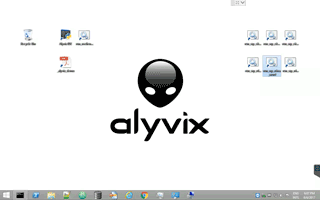

.. _home:

###########################
Visual Synthetic Monitoring
###########################

This is the official documentation of **Alyvix**.

Alyvix is a **synthetic monitoring system based on computer vision**. Alyvix synthesizes real users without being hardwired to application engines.

- Alyvix *automates any application*, interacting with GUIs exactly as a human would do.
- Alyvix *measures all transactions* and visualizes their performances in your monitoring system.
- Alyvix *reports HTML pages* containing the details of each test case step.

Alyvix provides **certifications on user perceived quality of IT services**. Alyvix certifies that users are able to successfully complete a certain application task.

:ref:`Get started with Alyvix!<install>`

=================
Use case examples
=================

Alyvix automates and measures Outlook through Citrix and RDWebAccess:

Alyvix automates and measures Word through Citrix and RDWebAccess:

======================
Documentation contents
======================

.. toctree::
   :maxdepth: 2
   :name: toc_master

   basic_principles.rst
   system_requirements.rst
   getting_started.rst
   test_case_building.rst
   test_case_execution.rst
   test_case_output.rst
   troubleshooting.rst
   get_in_touch.rst

===================
System requirements
===================

.. note::
    * **1 virtual or physical machine**, exclusively dedicated to serially run a number of Alyvix test cases
    * 2 or more machines are needed to run parallel test cases or to geographically distribute them
    * recommended screen resolution: 1280x720 HD or **1280x800 WXGA**

.. warning::
    * screen color depth: 24bit RGB or **32bit RGBA**
    * OS: **Windows 64bit** 10, 8, 7 Server 2012 or Server 2016
    * WinOS 32bit versions are not compatible
